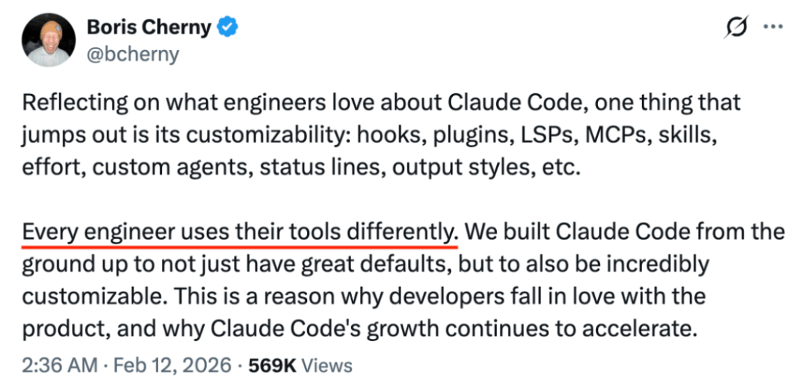
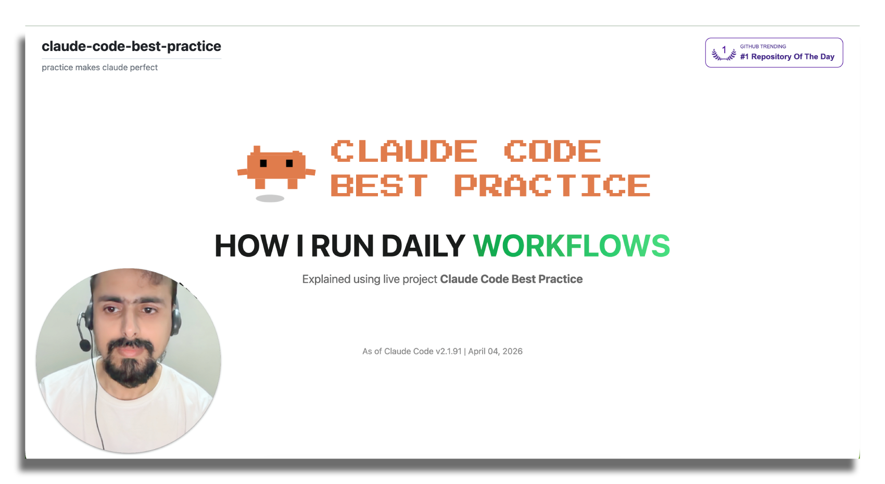
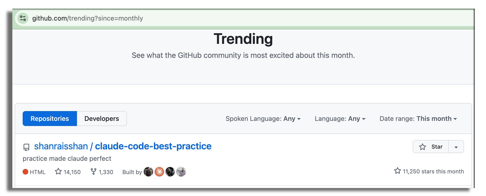

# claude-code-best-practice
从 vibe coding 到 agentic engineering —— 熟能生巧

-white?style=flat&labelColor=555) <a href="https://github.com/shanraisshan/claude-code-best-practice/stargazers"></a> <br>

[](best-practice/) [](implementation/) [](orchestration-workflow/orchestration-workflow.md) [](https://code.claude.com/docs) [](#-tips-and-tricks) [](#-subscribe) <br>
 = Agents ·  = Commands ·  = Skills

<p align="center">
  <br>
  <a href="https://github.com/trending"></a>
</p>

<p align="center">
  <br>
  Boris Cherny on X (<a href="https://x.com/bcherny/status/2007179832300581177">tweet 1</a> · <a href="https://x.com/bcherny/status/2017742741636321619">tweet 2</a> · <a href="https://x.com/bcherny/status/2021699851499798911">tweet 3</a>)
</p>


## 🧠 CONCEPTS

| Feature | Location | Description |
|---------|----------|-------------|
|  [**Subagents**](https://code.claude.com/docs/en/sub-agents) | `.claude/agents/<name>.md` | [](best-practice/claude-subagents.md) [](implementation/claude-subagents-implementation.md) 隔离上下文中的自主执行者 —— 自定义工具、权限、模型、记忆和持久身份 |
|  [**Commands**](https://code.claude.com/docs/en/slash-commands) | `.claude/commands/<name>.md` | [](best-practice/claude-commands.md) [](implementation/claude-commands-implementation.md) 注入到现有上下文的知识 —— 简单的用户调用提示模板，用于工作流编排 |
|  [**Skills**](https://code.claude.com/docs/en/skills) | `.claude/skills/<name>/SKILL.md` | [](best-practice/claude-skills.md) [](implementation/claude-skills-implementation.md) 注入到现有上下文的知识 —— 可配置、可预加载、可自动发现，支持上下文分叉和渐进式披露 · [官方 Skills](https://github.com/anthropics/skills/tree/main/skills) |
| [**Workflows**](https://code.claude.com/docs/en/common-workflows) | [`.claude/commands/weather-orchestrator.md`](.claude/commands/weather-orchestrator.md) | [](orchestration-workflow/orchestration-workflow.md) |
| [**Hooks**](https://code.claude.com/docs/en/hooks) | `.claude/hooks/` | [](https://github.com/shanraisshan/claude-code-hooks) [](https://github.com/shanraisshan/claude-code-hooks) 在 agentic loop 外部特定事件上运行的用户定义处理器（脚本、HTTP、提示、代理） · [指南](https://code.claude.com/docs/en/hooks-guide) |
| [**MCP Servers**](https://code.claude.com/docs/en/mcp) | `.claude/settings.json`, `.mcp.json` | [](best-practice/claude-mcp.md) [](.mcp.json) 连接外部工具、数据库和 API 的 Model Context Protocol |
| [**Plugins**](https://code.claude.com/docs/en/plugins) | 可分发包 | Skills、subagents、hooks、MCP servers 和 LSP servers 的捆绑包 · [市场](https://code.claude.com/docs/en/discover-plugins) · [创建市场](https://code.claude.com/docs/en/plugin-marketplaces) |
| [**Settings**](https://code.claude.com/docs/en/settings) | `.claude/settings.json` | [](best-practice/claude-settings.md) [](.claude/settings.json) 分层配置系统 · [权限](https://code.claude.com/docs/en/permissions) · [模型配置](https://code.claude.com/docs/en/model-config) · [输出风格](https://code.claude.com/docs/en/output-styles) · [沙箱](https://code.claude.com/docs/en/sandboxing) · [快捷键](https://code.claude.com/docs/en/keybindings) · [快速模式](https://code.claude.com/docs/en/fast-mode) |
| [**Status Line**](https://code.claude.com/docs/en/statusline) | `.claude/settings.json` | [](https://github.com/shanraisshan/claude-code-status-line) [](.claude/settings.json) 显示上下文使用、模型、成本和会话信息的可定制状态栏 |
| [**Memory**](https://code.claude.com/docs/en/memory) | `CLAUDE.md`, `.claude/rules/`, `~/.claude/rules/`, `~/.claude/projects/<project>/memory/` | [](best-practice/claude-memory.md) [](CLAUDE.md) 通过 CLAUDE.md 文件和 `@path` 导入实现持久上下文 · [自动记忆](https://code.claude.com/docs/en/memory) · [规则](https://code.claude.com/docs/en/memory#organize-rules-with-clauderules) |
| [**Checkpointing**](https://code.claude.com/docs/en/checkpointing) | 自动（基于 git） | 自动跟踪文件编辑，支持回退（`Esc Esc` 或 `/rewind`) 和定向摘要 |
| [**CLI Startup Flags**](https://code.claude.com/docs/en/cli-reference) | `claude [flags]` | [](best-practice/claude-cli-startup-flags.md) 启动 Claude Code 的命令行标志、子命令和环境变量 · [交互模式](https://code.claude.com/docs/en/interactive-mode) · [环境变量](https://code.claude.com/docs/en/env-vars) |
| **AI Terms** | | [](https://github.com/shanraisshan/claude-code-codex-cursor-gemini/blob/main/reports/ai-terms.md) Agentic Engineering · Context Engineering · Vibe Coding |
| [**Best Practices**](https://code.claude.com/docs/en/best-practices) | | 官方最佳实践 · [提示工程](https://github.com/anthropics/prompt-eng-interactive-tutorial) · [扩展 Claude Code](https://code.claude.com/docs/en/features-overview) |

### 🔥 Hot

| Feature | Location | Description |
|---------|----------|-------------|
| [**Routines**](https://code.claude.com/docs/en/routines)  | `claude.ai/code/routines`, `/schedule` | Anthropic 基础设施上的云端自动化 —— 定时、API 触发或 GitHub 事件驱动的任务，即使你的机器关闭也能运行 · [桌面任务](https://code.claude.com/docs/en/desktop-scheduled-tasks) |
| [**Devcontainers**](https://code.claude.com/docs/en/devcontainer) | `.devcontainer/` | 预配置的开发容器，带安全隔离和防火墙规则，提供一致的 Claude Code 环境 |
| [**Channels**](https://code.claude.com/docs/en/channels)  | `--channels`, 插件式 | 从 Telegram、Discord 或 webhooks 推送事件到运行中的会话 —— Claude 在你离开时也能响应 · [参考](https://code.claude.com/docs/en/channels-reference) |
| [**Ultraplan**](https://code.claude.com/docs/en/ultraplan)  | `/ultraplan` | 在云端起草计划，基于浏览器审查、内联评论，灵活执行 —— 远程执行或传送回终端 |
| [**No Flicker Mode**](https://code.claude.com/docs/en/fullscreen)  | `CLAUDE_CODE_NO_FLICKER=1` | [](https://x.com/bcherny/status/2039421575422980329) 无闪烁 alt-screen 渲染，支持鼠标、稳定内存和内置滚动 —— 可选的研究预览 |
| [**Auto Mode**](https://code.claude.com/docs/en/permission-modes#eliminate-prompts-with-auto-mode)  | `claude --enable-auto-mode` | [](https://x.com/claudeai/status/2036503582166393240) 后台安全分类器替代手动权限提示 —— Claude 决定什么安全，同时阻止提示注入和危险升级 · 用 `claude --enable-auto-mode`（或 `--permission-mode auto`）启动，或在会话中用 `Shift+Tab` 切换 · [博客](https://claude.com/blog/auto-mode) |
| [**Power-ups**](best-practice/claude-power-ups.md) | `/powerup` | [](best-practice/claude-power-ups.md) 带动画演示的互动课程，教你使用 Claude Code 功能（v2.1.90） |
| [**Computer Use**](https://code.claude.com/docs/en/computer-use)  | `computer-use` MCP server | 让 Claude 控制你的屏幕 —— 打开应用、点击、输入、截屏你的 macOS 显示 · [桌面](https://code.claude.com/docs/en/desktop#let-claude-use-your-computer) |
| [**Agent SDK**](https://code.claude.com/docs/en/agent-sdk/overview) | `npm` / `pip` 包 | 用 Claude Code 作为库构建生产级 AI agents —— Python 和 TypeScript SDK，内置工具、hooks、subagents 和 MCP · [快速开始](https://code.claude.com/docs/en/agent-sdk/quickstart) · [示例](https://github.com/anthropics/claude-agent-sdk-demos) |
| [**Ralph Wiggum Loop**](https://github.com/anthropics/claude-code/tree/main/plugins/ralph-wiggum) | plugin | [](https://github.com/ghuntley/how-to-ralph-wiggum) [](https://github.com/shanraisshan/novel-llm-26) 用于长时间运行任务的自主开发循环 —— 持续迭代直到完成 |
| [**Chrome**](https://code.claude.com/docs/en/chrome)  | `--chrome`, extension | [](reports/claude-in-chrome-v-chrome-devtools-mcp.md) 通过 Claude in Chrome 实现浏览器自动化 —— 测试 web 应用、用 console 调试、自动化表单、从页面提取数据 |
| [**Claude Code Web**](https://code.claude.com/docs/en/claude-code-on-the-web)  | `claude.ai/code` | 在云端基础设施上运行任务 —— 长时间运行任务、PR auto-fix、并行会话，无需本地设置 · [Routines](https://code.claude.com/docs/en/routines) |
| [**Slack**](https://code.claude.com/docs/en/slack) | `@Claude` in Slack | 在团队聊天中提及 @Claude 并给出编码任务 —— 路由到 Claude Code web 会话处理 bug 修复、代码审查和并行任务执行 |
| [**Code Review**](https://code.claude.com/docs/en/code-review)  | GitHub App（托管） | [](https://x.com/claudeai/status/2031088171262554195) 多代理 PR 分析，捕获 bug、安全漏洞和回归 · [博客](https://claude.com/blog/code-review) |
| [**GitHub Actions**](https://code.claude.com/docs/en/github-actions) | `.github/workflows/` | 在 CI/CD 流中自动化 PR 审查、issue 分类和代码生成 · [GitLab CI/CD](https://code.claude.com/docs/en/gitlab-ci-cd) |
| [**Remote Control**](https://code.claude.com/docs/en/remote-control) | `/remote-control`, `/rc` | [](https://x.com/noahzweben/status/2032533699116355819) 从任意设备继续本地会话 —— 手机、平板或浏览器 · [Headless Mode](https://code.claude.com/docs/en/headless) |
| [**Agent Teams**](https://code.claude.com/docs/en/agent-teams)  | built-in（环境变量） | [](https://x.com/bcherny/status/2019472394696683904) [](implementation/claude-agent-teams-implementation.md) 多个代理在同一代码库上并行工作，共享任务协调 |
| [**Scheduled Tasks**](https://code.claude.com/docs/en/scheduled-tasks) | `/loop`, `/schedule`, cron tools | [](https://x.com/bcherny/status/2030193932404150413) [](implementation/claude-scheduled-tasks-implementation.md) `/loop` 在本地按周期运行提示（最长 7 天） · [`/schedule`](https://code.claude.com/docs/en/routines) 在 Anthropic 云端基础设施上运行提示 —— 即使你的机器关闭也能运行 · [公告](https://x.com/noahzweben/status/2036129220959805859) |
| [**Voice Dictation**](https://code.claude.com/docs/en/voice-dictation)  | `/voice` | [](https://x.com/trq212/status/2028628570692890800) 按住说话的语音输入，支持 20 种语言，可重新绑定激活键 |
| [**Simplify & Batch**](https://code.claude.com/docs/en/skills#bundled-skills) | `/simplify`, `/batch` | [](https://x.com/bcherny/status/2027534984534544489) 内置 skills 用于代码质量和批量操作 —— simplify 重构以提高复用和效率，batch 跨文件运行命令 |
| [**Git Worktrees**](https://code.claude.com/docs/en/common-workflows#run-parallel-claude-code-sessions-with-git-worktrees) | built-in | [](https://x.com/bcherny/status/2025007393290272904) 用于并行开发的隔离 git 分支 —— 每个代理有自己的工作副本 |

<p align="center">
  
</p>

<a id="orchestration-workflow"></a>

## <a href="orchestration-workflow/orchestration-workflow.md"></a>

详见 [orchestration-workflow](orchestration-workflow/orchestration-workflow.md) 了解  **Command** →  **Agent** →  **Skill** 模式的实现细节。


<p align="center">
  
</p>

<p align="center">
  
</p>


```bash
claude
/weather-orchestrator
```

<p align="center">
  
</p>

## ⚙️ DEVELOPMENT WORKFLOWS

所有主要工作流都遵循同一架构模式：**研究 → 计划 → 执行 → 审查 → 发布**

| Name | ★ | 特点 | Plan |  |  |  |
|------|---|------------|------|---|---|---|
| [Everything Claude Code](https://github.com/affaan-m/everything-claude-code) | 156k |    |  [planner](https://github.com/affaan-m/everything-claude-code/blob/main/agents/planner.md) | 48 | 143 | 230 |
| [Superpowers](https://github.com/obra/superpowers) | 152k |    |  [writing-plans](https://github.com/obra/superpowers/tree/main/skills/writing-plans) | 5 | 3 | 14 |
| [Spec Kit](https://github.com/github/spec-kit) | 88k |    |  [speckit.plan](https://github.com/github/spec-kit/blob/main/templates/commands/plan.md) | 0 | 9+ | 0 |
| [gstack](https://github.com/garrytan/gstack) | 72k |    |  [autoplan](https://github.com/garrytan/gstack/tree/main/autoplan) | 0 | 0 | 36 |
| [Get Shit Done](https://github.com/gsd-build/get-shit-done) | 53k |    |  [gsd-planner](https://github.com/gsd-build/get-shit-done/blob/main/agents/gsd-planner.md) | 31 | 122 | 0 |
| [BMAD-METHOD](https://github.com/bmad-code-org/BMAD-METHOD) | 45k |    |  [bmad-create-prd](https://github.com/bmad-code-org/BMAD-METHOD/tree/main/src/bmm-skills/2-plan-workflows/bmad-create-prd) | 0 | 0 | 37 |
| [OpenSpec](https://github.com/Fission-AI/OpenSpec) | 40k |    |  [opsx:propose](https://github.com/Fission-AI/OpenSpec/blob/main/src/commands/workflow/new-change.ts) | 0 | 10 | 0 |
| [oh-my-claudecode](https://github.com/Yeachan-Heo/oh-my-claudecode) | 29k |    |  [ralplan](https://github.com/Yeachan-Heo/oh-my-claudecode/tree/main/skills/ralplan) | 19 | 0 | 37 |
| [Compound Engineering](https://github.com/EveryInc/compound-engineering-plugin) | 14k |    |  [ce-plan](https://github.com/EveryInc/compound-engineering-plugin/tree/main/plugins/compound-engineering/skills/ce-plan) | 49 | 4 | 42 |
| [HumanLayer](https://github.com/humanlayer/humanlayer) | 10k |    |  [create_plan](https://github.com/humanlayer/humanlayer/blob/main/.claude/commands/create_plan.md) | 6 | 27 | 0 |

### Others
- [Cross-Model（Claude Code + Codex）工作流](development-workflows/cross-model-workflow/cross-model-workflow.md) [](development-workflows/cross-model-workflow/cross-model-workflow.md)
- [RPI](development-workflows/rpi/rpi-workflow.md) [](development-workflows/rpi/rpi-workflow.md)
- [Ralph Wiggum Loop](https://www.youtube.com/watch?v=eAtvoGlpeRU) [](https://github.com/shanraisshan/novel-llm-26)
- [Andrej Karpathy（OpenAI 创始成员）工作流](https://x.com/karpathy/status/2015883857489522876)
- [Peter Steinberger（OpenClaw 创建者）工作流](https://youtu.be/8lF7HmQ_RgY?t=2582)
- Boris Cherny（Claude Code 创建者）工作流 — [13 Tips](tips/claude-boris-13-tips-03-jan-26.md) · [10 Tips](tips/claude-boris-10-tips-01-feb-26.md) · [12 Tips](tips/claude-boris-12-tips-12-feb-26.md) · [2 Tips](tips/claude-boris-2-tips-25-mar-26.md) · [15 Tips](tips/claude-boris-15-tips-30-mar-26.md) [](https://x.com/bcherny)
- Thariq（Anthropic）工作流 — [Skills](tips/claude-thariq-tips-17-mar-26.md) · [会话管理](tips/claude-thariq-tips-16-apr-26.md) [](https://x.com/trq212)

<p align="center">
  
</p>

## 💡 TIPS AND TRICKS (69)

🚫👶 = 不要当保姆盯着它

[Prompting](#tips-prompting) · [Planning](#tips-planning) · [CLAUDE.md](#tips-claudemd) · [Agents](#tips-agents) · [Commands](#tips-commands) · [Skills](#tips-skills) · [Hooks](#tips-hooks) · [Workflows](#tips-workflows) · [Advanced](#tips-workflows-advanced) · [Git / PR](#tips-git-pr) · [Debugging](#tips-debugging) · [Utilities](#tips-utilities) · [Daily](#tips-daily)


<a id="tips-prompting"></a>■ **Prompting (3)**

| Tip | Source |
|-----|--------|
| 挑战 Claude —— "针对这些变化拷问我，在我通过你的测试之前不要做 PR" 或 "证明这能工作" 并让 Claude diff main 和你的分支 🚫👶 | [](https://x.com/bcherny/status/2017742752566632544) |
| 在一个平庸的修复后 —— "基于你现在知道的一切，扔掉这个并实现优雅的解决方案" 🚫👶 | [](https://x.com/bcherny/status/2017742752566632544) |
| Claude 自己能修复大部分 bug —— 粘贴 bug，说 "fix"，不要微观管理怎么修 🚫👶 | [](https://x.com/bcherny/status/2017742750473720121) |

<a id="tips-planning"></a>■ **Planning/Specs (6)**

| Tip | Source |
|-----|--------|
| 总是从 [plan mode](https://code.claude.com/docs/en/common-workflows) 开始 | [](https://x.com/bcherny/status/2007179845336527000) |
| 从一个最小的 spec 或提示开始，让 Claude 用 [AskUserQuestion](https://code.claude.com/docs/en/cli-reference) 工具面试你，然后新会话执行 spec | [](https://x.com/trq212/status/2005315275026260309) |
| 总是做一个分阶段的 gated plan，每阶段有多个测试（单元、自动化、集成） | |
| 启动第二个 Claude 作为 staff engineer 审查你的计划，或用 [cross-model](development-workflows/cross-model-workflow/cross-model-workflow.md) 做审查 | [](https://x.com/bcherny/status/2017742745365057733) |
| 在交接工作前写详细 specs 并减少歧义 —— 你越具体，输出越好 | [](https://x.com/bcherny/status/2017742752566632544) |
| prototype > PRD —— 做 20-30 个版本而不是写 specs，构建成本低所以多尝试 | [](https://youtu.be/julbw1JuAz0?t=3630) [](https://youtu.be/julbw1JuAz0?t=3630) |

<a id="tips-claudemd"></a>■ **CLAUDE.md (7)**

| Tip | Source |
|-----|--------|
| [CLAUDE.md](https://code.claude.com/docs/en/memory) 每个文件目标控制在 [200 行以内](https://code.claude.com/docs/en/memory#write-effective-instructions)。[humanlayer 里 60 行](https://www.humanlayer.dev/blog/writing-a-good-claude-md) ([仍不是 100% 保证](https://www.reddit.com/r/ClaudeCode/comments/1qn9pb9/claudemd_says_must_use_agent_claude_ignores_it_80/)) | [](https://x.com/bcherny/status/2007179840848597422) [](https://www.humanlayer.dev/blog/writing-a-good-claude-md) |
| 用 [\<important if="..."\> 标签](https://www.hlyr.dev/blog/stop-claude-from-ignoring-your-claude-md) 包裹领域特定的 CLAUDE.md 规则，防止 Claude 在文件变长时忽略它们 | [](https://www.hlyr.dev/blog/stop-claude-from-ignoring-your-claude-md) |
| monorepo 用 [多个 CLAUDE.md](best-practice/claude-memory.md) —— ancestor + descendant 加载 | |
| 用 [.claude/rules/](https://code.claude.com/docs/en/memory#organize-rules-with-clauderules) 分拆大指令 | |
| [memory.md](https://code.claude.com/docs/en/memory)、constitution.md 不保证任何事 | |
| 任何开发者应该能启动 Claude，说 "运行测试" 并第一次就成功 —— 如果不行，你的 CLAUDE.md 缺少必要的 setup/build/test 命令 | [](https://x.com/dexhorthy/status/2034713765401551053) |
| 保持代码库干净，完成迁移 —— 部分迁移的框架会让模型困惑，可能选错模式 | [](https://youtu.be/julbw1JuAz0?t=1112) [](https://youtu.be/julbw1JuAz0?t=1112) |
| 用 [settings.json](best-practice/claude-settings.md) 实现 harness 强制的行为（签名、权限、模型） —— 不要把 "NEVER add Co-Authored-By" 放在 CLAUDE.md 里，当 `attribution.commit: ""` 是确定性的 | [](https://x.com/dani_avila7/status/2036182734310195550) |

<a id="tips-agents"></a> **Agents (4)**

| Tip | Source |
|-----|--------|
| 有特定功能的 [sub-agents](https://code.claude.com/docs/en/sub-agents)（额外上下文）配 [skills](https://code.claude.com/docs/en/skills)（渐进披露），而不是通用的 qa、backend engineer | [](https://x.com/bcherny/status/2007179850139000872) |
| 说 "use subagents" 给问题投入更多算力 —— 把任务分流，保持主上下文干净聚焦 🚫👶 | [](https://x.com/bcherny/status/2017742755737555434) |
| [agent teams 配 tmux](https://code.claude.com/docs/en/agent-teams) 和 [git worktrees](https://x.com/bcherny/status/2025007393290272904) 实现并行开发 | |
| 用 [test time compute](https://code.claude.com/docs/en/sub-agents) —— 分离的上下文窗口让结果更好；一个代理可能制造 bug，另一个（同模型）能发现 🚫👶 | [](https://x.com/bcherny/status/2031151689219321886) |

<a id="tips-commands"></a> **Commands (3)**

| Tip | Source |
|-----|--------|
| 用 [commands](https://code.claude.com/docs/en/slash-commands) 处理你的工作流，而不是 [sub-agents](https://code.claude.com/docs/en/sub-agents) | [](https://x.com/bcherny/status/2007179847949500714) |
| 为你每天做多次的每个 "inner loop" 工作流使用 [slash commands](https://code.claude.com/docs/en/slash-commands) —— 避免重复提示，commands 放在 `.claude/commands/` 并提交到 git | [](https://x.com/bcherny/status/2007179847949500714) |
| 如果你每天做某事超过一次，把它变成 [skill](https://code.claude.com/docs/en/skills) 或 [command](https://code.claude.com/docs/en/slash-commands) —— 建立 `/techdebt`、context-dump 或 analytics commands | [](https://x.com/bcherny/status/2017742748984742078) |

<a id="tips-skills"></a> **Skills (9)**

| Tip | Source |
|-----|--------|
| 用 [context: fork](https://code.claude.com/docs/en/skills) 在隔离子代理中运行 skill —— 主上下文只看到最终结果，不是中间工具调用。agent 字段让你设置子代理类型 | [](https://x.com/lydiahallie/status/2033603164398883042) |
| monorepo 用 [子文件夹里的 skills](reports/claude-skills-for-larger-mono-repos.md) | |
| skills 是文件夹，不是文件 —— 用 references/、scripts/、examples/ 子目录实现 [渐进披露](https://code.claude.com/docs/en/skills) | [](https://x.com/trq212/status/2033949937936085378) |
| 在每个 skill 里建立 Gotchas 部分 —— 最高信号内容，随时间添加 Claude 的失败点 | [](https://x.com/trq212/status/2033949937936085378) |
| skill description 字段是触发器，不是摘要 —— 为模型写（"我何时触发？") | [](https://x.com/trq212/status/2033949937936085378) |
| 不要在 skills 里陈述显而易见的事 —— 关注能让 Claude 超出默认行为的内容 🚫👶 | [](https://x.com/trq212/status/2033949937936085378) |
| 不要在 skills 里规定 Claude 做什么 —— 给目标和约束，不给规定性的步骤指令 🚫👶 | [](https://x.com/trq212/status/2033949937936085378) |
| 在 skills 里包含 scripts 和 libraries，让 Claude 组合而非重构样板代码 | [](https://x.com/trq212/status/2033949937936085378) |
| 在 SKILL.md 里嵌入 `` !`command` `` 注入动态 shell 输出到提示 —— Claude 在调用时运行，模型只看到结果 | [](https://x.com/lydiahallie/status/2034337963820327017) |

<a id="tips-hooks"></a>■ **Hooks (5)**

| Tip | Source |
|-----|--------|
| 在 skills 里用 [on-demand hooks](https://code.claude.com/docs/en/skills) —— /careful 阻止破坏性命令，/freeze 阻止目录外的编辑 | [](https://x.com/trq212/status/2033949937936085378) |
| 用 PreToolUse hook [测量 skill 使用](https://code.claude.com/docs/en/skills) 发现热门或触发不足的 skills | [](https://x.com/trq212/status/2033949937936085378) |
| 用 [PostToolUse hook](https://code.claude.com/docs/en/hooks) 自动格式化代码 —— Claude 生成格式良好的代码，hook 处理最后 10% 避免 CI 失败 | [](https://x.com/bcherny/status/2007179852047335529) |
| 通过 hook 把 [权限请求](https://code.claude.com/docs/en/hooks) 路由给 Opus —— 让它扫描攻击并自动批准安全的 🚫👶 | [](https://x.com/bcherny/status/2017742755737555434) |
| 用 [Stop hook](https://code.claude.com/docs/en/hooks) 在回合结束时推动 Claude 继续或验证其工作 | [](https://x.com/bcherny/status/2021701059253874861) |

<a id="tips-workflows"></a>■ **Workflows (7)**

| Tip | Source |
|-----|--------|
| 避免 agent dumb zone，在最多 50% 时手动 [/compact](https://code.claude.com/docs/en/interactive-mode)。如果切换到新任务，用 [/clear](https://code.claude.com/docs/en/cli-reference) 重置上下文 | |
| 对于较小任务，vanilla cc 比任何工作流都好 | |
| 用 [/model](https://code.claude.com/docs/en/model-config) 选择模型和推理，[/context](https://code.claude.com/docs/en/interactive-mode) 查看上下文使用，[/usage](https://code.claude.com/docs/en/costs) 检查套餐限制，[/extra-usage](https://code.claude.com/docs/en/interactive-mode) 配置溢出计费，[/config](https://code.claude.com/docs/en/settings) 配置设置 —— plan mode 用 Opus，写代码用 Sonnet，获得两者最佳 | [](https://x.com/_catwu/status/1955694117264261609) |
| 总是用 [thinking mode](https://code.claude.com/docs/en/model-config) true（看推理）和 [/config](https://code.claude.com/docs/en/settings) 里 [Output Style](https://code.claude.com/docs/en/output-styles) Explanatory（看带 ★ Insight 框的详细输出）更好理解 Claude 的决策 | [](https://x.com/bcherny/status/2007179838864666847) |
| 在提示里用 ultrathink 关键词触发 [高努力推理](https://docs.anthropic.com/en/docs/build-with-claude/extended-thinking#tips-and-best-practices) | |
| [/rename](https://code.claude.com/docs/en/cli-reference) 重要会话（如 [TODO - refactor task]）并稍后 [/resume](https://code.claude.com/docs/en/cli-reference) —— 同时运行多个 Claude 时标记每个实例 | [](https://every.to/podcast/how-to-use-claude-code-like-the-people-who-built-it) |
| Claude 跑偏时用 [Esc Esc 或 /rewind](https://code.claude.com/docs/en/checkpointing) 回退，而不是在相同上下文里尝试修复 | |

<a id="tips-workflows-advanced"></a>■ **Workflows Advanced (6)**

| Tip | Source |
|-----|--------|
| 大量使用 ASCII 图来理解你的架构 | [](https://x.com/bcherny/status/2017742759218794768) |
| 用 [/loop](https://code.claude.com/docs/en/scheduled-tasks) 做本地周期监控（最长 3 天） · 用 [/schedule](https://code.claude.com/docs/en/web-scheduled-tasks) 做云端周期任务，即使你的机器关闭也能运行 | |
| 用 [Ralph Wiggum plugin](https://github.com/shanraisshan/novel-llm-26) 做长时间运行的自主任务 | [](https://x.com/bcherny/status/2007179858435281082) |
| [/permissions](https://code.claude.com/docs/en/permissions) 用通配符语法（Bash(npm run *), Edit(/docs/**)）而不是 dangerously-skip-permissions | [](https://x.com/bcherny/status/2007179854077407667) |
| [/sandbox](https://code.claude.com/docs/en/sandboxing) 用文件和网络隔离减少权限提示 —— 内部减少 84% | [](https://x.com/bcherny/status/2021700506465579443) [](https://creatoreconomy.so/p/inside-claude-code-how-an-ai-native-actually-works-cat-wu) |
| 投入时间打造 [产品验证](https://code.claude.com/docs/en/skills) skills（signup-flow-driver、checkout-verifier） —— 值得花一周完善 | [](https://x.com/trq212/status/2033949937936085378) |

<a id="tips-git-pr"></a>■ **Git / PR (5)**

| Tip | Source |
|-----|--------|
| 保持 PR 小且聚焦 —— [p58 118 行](tips/claude-boris-2-tips-25-mar-26.md)（141 个 PR，一天改 45K 行），一个功能一个 PR，更容易审查和回退 | [](https://x.com/bcherny/status/2038552880018538749) |
| 总是 [squash merge](tips/claude-boris-2-tips-25-mar-26.md) PR —— 干净线性历史，一个功能一个 commit，方便 git revert 和 git bisect | [](https://x.com/bcherny/status/2038552880018538749) |
| 经常 commit —— 尝试每小时至少 commit 一次，任务完成就立即 commit |  |
| 在同事 PR 上 tag [@claude](https://github.com/apps/claude) 自动生成 lint 规则处理重复审查反馈 —— 把你自己从代码审查中自动化出去 🚫👶 | [](https://youtu.be/julbw1JuAz0?t=2715) [](https://youtu.be/julbw1JuAz0?t=2715) |
| 用 [/code-review](https://code.claude.com/docs/en/code-review) 做多代理 PR 分析 —— 在合并前捕获 bug、安全漏洞和回归 | [](https://x.com/bcherny/status/2031089411820228645) |

<a id="tips-debugging"></a>■ **Debugging (7)**

| Tip | Source |
|-----|--------|
| 养成截图习惯，遇到任何问题时分享给 Claude |  |
| 用 mcp（[Claude in Chrome](https://code.claude.com/docs/en/chrome)、[Playwright](https://github.com/microsoft/playwright-mcp)、[Chrome DevTools](https://developer.chrome.com/blog/chrome-devtools-mcp)）让 claude 自己看 chrome console logs | |
| 总是让 claude 把你想看日志的终端作为后台任务运行，便于调试 | |
| [/doctor](https://code.claude.com/docs/en/cli-reference) 诊断安装、认证和配置问题 | |
| 压缩时的错误可以用 [/model](https://code.claude.com/docs/en/model-config) 选择 1M token 模型，然后运行 [/compact](https://code.claude.com/docs/en/interactive-mode) 解决 | |
| 用 [cross-model](development-workflows/cross-model-workflow/cross-model-workflow.md) 做 QA —— 如 [Codex](https://github.com/shanraisshan/codex-cli-best-practice) 计划和实现审查 | |
| agentic search（glob + grep）比 RAG 好 —— Claude Code 尝试过向量数据库但放弃了，因为代码会漂移脱节且权限复杂 | [](https://youtu.be/julbw1JuAz0?t=3095) [](https://youtu.be/julbw1JuAz0?t=3095) |

<a id="tips-utilities"></a>■ **Utilities (5)**

| Tip | Source |
|-----|--------|
| 用 [iTerm](https://iterm2.com/)/[Ghostty](https://ghostty.org/)/[tmux](https://github.com/tmux/tmux) 终端而不是 IDE（[VS Code](https://code.visualstudio.com/)/[Cursor](https://www.cursor.com/)） | [](https://x.com/bcherny/status/2017742753971769626) |
| [/voice](https://code.claude.com/docs/en/voice-dictation) 或 [Wispr Flow](https://wisprflow.ai) 做语音提示（10x 效率） | [](https://x.com/bcherny/status/2038454362226467112) |
| [claude-code-hooks](https://github.com/shanraisshan/claude-code-hooks) 做 claude 反馈 |  |
| [status line](https://github.com/shanraisshan/claude-code-status-line) 做上下文感知和快速压缩 | [](https://x.com/bcherny/status/2021700784019452195)  |
| 探索 [settings.json](best-practice/claude-settings.md) 功能如 [Plans Directory](best-practice/claude-settings.md#plans-directory)、[Spinner Verbs](best-practice/claude-settings.md#display--ux) 获得个性化体验 | [](https://x.com/bcherny/status/2021701145023197516) |

<a id="tips-daily"></a>■ **Daily (2)**

| Tip | Source |
|-----|--------|
| [更新](https://code.claude.com/docs/en/setup) Claude Code 每天 |  |
| 一天开始时阅读 [changelog](https://github.com/anthropics/claude-code/blob/main/CHANGELOG.md) |  |


| Article / Tweet | Source |
|-----------------|--------|
| [会话管理 & 1M Context（Thariq） \| 16/Apr/26](tips/claude-thariq-tips-16-apr-26.md) | [Tweet](https://x.com/trq212) |
| [15 个 Claude Code 隐藏和未充分利用的功能（Boris） \| 30/Mar/26](tips/claude-boris-15-tips-30-mar-26.md) | [Tweet](https://x.com/bcherny/status/2038454336355999749) |
| [Squash Merging & PR Size Distribution（Boris） \| 25/Mar/26](tips/claude-boris-2-tips-25-mar-26.md) | [Tweet](https://x.com/bcherny/status/2038552880018538749) |
| [构建 Claude Code 的经验：我们如何使用 Skills（Thariq） \| 17/Mar/26](tips/claude-thariq-tips-17-mar-26.md) | [Article](https://x.com/trq212/status/2033949937936085378) |
| [Code Review & Test Time Compute（Boris） \| 10/Mar/26](tips/claude-boris-2-tips-10-mar-26.md) | [Tweet](https://x.com/bcherny/status/2031089411820228645) |
| /loop — 最多 3 天的周期任务（Boris） \| 07 Mar 2026 | [Tweet](https://x.com/bcherny/status/2030193932404150413) |
| AskUserQuestion + ASCII Markdowns（Thariq） \| 28 Feb 2026 | [Tweet](https://x.com/trq212/status/2027543858289250472) |
| Seeing like an Agent - 构建 Claude Code 的经验（Thariq） \| 28 Feb 2026 | [Article](https://x.com/trq212/status/2027463795355095314) |
| Git Worktrees - Boris 的 5 种用法 \| 21 Feb 2026 | [Tweet](https://x.com/bcherny/status/2025007393290272904) |
| 构建 Claude Code 的经验：Prompt Caching Is Everything（Thariq） \| 20 Feb 2026 | [Article](https://x.com/trq212/status/2024574133011673516) |
| [12 种人们定制 Claude 的方式（Boris） \| 12/Feb/26](tips/claude-boris-12-tips-12-feb-26.md) | [Tweet](https://x.com/bcherny/status/2021699851499798911) |
| [团队使用 Claude Code 的 10 个技巧（Boris） \| 01/Feb/26](tips/claude-boris-10-tips-01-feb-26.md) | [Tweet](https://x.com/bcherny/status/2017742741636321619) |
| [我如何使用 Claude Code —— 来自我意外 vanilla 设置的 13 个技巧（Boris） \| 03/Jan/26](tips/claude-boris-13-tips-03-jan-26.md) | [Tweet](https://x.com/bcherny/status/2007179832300581177) |
| 让 Claude 用 AskUserQuestion tool 面试你（Thariq） \| 28/Dec/25 | [Tweet](https://x.com/trq212/status/2005315275026260309) |
| 总是用 plan mode，给 Claude 验证方式，用 /code-review（Boris） \| 27/Dec/25 | [Tweet](https://x.com/bcherny/status/2004711722926616680) |

<p align="center">
  
</p>

## 💡 TIPS AND TRICKS (69)

🚫👶 = 不要盯着看

[提示技巧](#tips-prompting) · [计划规划](#tips-planning) · [CLAUDE.md](#tips-claudemd) · [Agents](#tips-agents) · [Commands](#tips-commands) · [Skills](#tips-skills) · [Hooks](#tips-hooks) · [工作流](#tips-workflows) · [高级工作流](#tips-workflows-advanced) · [Git / PR](#tips-git-pr) · [调试](#tips-debugging) · [工具](#tips-utilities) · [日常](#tips-daily)


<a id="tips-prompting"></a>■ **提示技巧 (3)**

| Tip | Source |
|-----|--------|
| 挑战 Claude —— "就这些变化质问我，在我通过你的测试之前不要创建 PR。" 或 "向我证明这能工作"，让 Claude diff main 和你的分支 🚫👶 | [](https://x.com/bcherny/status/2017742752566632544) |
| 在一次平庸的修复后 —— "结合你现在知道的一切，废弃这个方案并实现优雅的解决方案" 🚫👶 | [](https://x.com/bcherny/status/2017742752566632544) |
| Claude 自己修复大部分 bug —— 粘贴 bug，说 "修复"，不要微观管理怎么修 🚫👶 | [](https://x.com/bcherny/status/2017742750473720121) |

<a id="tips-planning"></a>■ **计划/规范 (6)**

| Tip | Source |
|-----|--------|
| 总是从 [plan mode](https://code.claude.com/docs/en/common-workflows) 开始 | [](https://x.com/bcherny/status/2007179845336527000) |
| 从最小规范或提示开始，让 Claude 用 [AskUserQuestion](https://code.claude.com/docs/en/cli-reference) 工具采访你，然后创建新会话执行规范 | [](https://x.com/trq212/status/2005315275026260309) |
| 总是制作分阶段的 gated plan，每个阶段有多个测试（单元、自动化、集成） | |
| 启动第二个 Claude 以 staff engineer 角度审查你的计划，或用 [cross-model](development-workflows/cross-model-workflow/cross-model-workflow.md) 审查 | [](https://x.com/bcherny/status/2017742745365057733) |
| 在移交工作前编写详细规范并减少歧义 —— 你越具体，输出越好 | [](https://x.com/bcherny/status/2017742752566632544) |
| 原型 > PRD —— 构建而不是写规范，构建成本低所以多尝试 20-30 个版本 | [](https://youtu.be/julbw1JuAz0?t=3630) [](https://youtu.be/julbw1JuAz0?t=3630) |

<a id="tips-claudemd"></a>■ **CLAUDE.md (7)**

| Tip | Source |
|-----|--------|
| [CLAUDE.md](https://code.claude.com/docs/en/memory) 应控制在 [200 行](https://code.claude.com/docs/en/memory#write-effective-instructions) 以内。humanlayer 建议 [60 行](https://www.humanlayer.dev/blog/writing-a-good-claude-md)（[仍不能 100% 保证](https://www.reddit.com/r/ClaudeCode/comments/1qn9pb9/claudemd_says_must_use_agent_claude_ignores_it_80/)) | [](https://x.com/bcherny/status/2007179840848597422) [](https://www.humanlayer.dev/blog/writing-a-good-claude-md) |
| 用 [\<important if="..."\> 标签](https://www.hlyr.dev/blog/stop-claude-from-ignoring-your-claude-md) 包裹领域特定的 CLAUDE.md 规则，防止文件变长时 Claude 忽略它们 | [](https://www.hlyr.dev/blog/stop-claude-from-ignoring-your-claude-md) |
| 在 monorepo 使用 [多个 CLAUDE.md](best-practice/claude-memory.md) —— ancestor + descendant 加载 | |
| 用 [.claude/rules/](https://code.claude.com/docs/en/memory#organize-rules-with-clauderules) 分割大型指令 | |
| memory.md、constitution.md 不保证任何事情 | |
| 任何开发者都应该能启动 Claude，说 "运行测试" 并第一次就成功 —— 如果不行，你的 CLAUDE.md 缺少必要的 setup/build/test 命令 | [](https://x.com/dexhorthy/status/2034713765401551053) |
| 保持代码库清洁并完成迁移 —— 部分迁移的框架会混淆模型，可能选择错误模式 | [](https://youtu.be/julbw1JuAz0?t=1112) [](https://youtu.be/julbw1JuAz0?t=1112) |
| 用 [settings.json](best-practice/claude-settings.md) 进行 harness 强制行为（签名、权限、模型） —— 不要在 CLAUDE.md 写 "NEVER add Co-Authored-By"，当 `attribution.commit: ""` 是确定性的 | [](https://x.com/dani_avila7/status/2036182734310195550) |

<a id="tips-agents"></a> **Agents (4)**

| Tip | Source |
|-----|--------|
| 创建功能特定的 [sub-agents](https://code.claude.com/docs/en/sub-agents)（额外上下文）配合 [skills](https://code.claude.com/docs/en/skills)（渐进式披露），而不是通用的 qa、backend engineer | [](https://x.com/bcherny/status/2007179850139000872) |
| 说 "用 subagents" 来增加计算量 —— 把任务分流以保持主上下文清洁专注 🚫👶 | [](https://x.com/bcherny/status/2017742755737555434) |
| 用 [agent teams 配 tmux](https://code.claude.com/docs/en/agent-teams) 和 [git worktrees](https://x.com/bcherny/status/2025007393290272904) 进行并行开发 | |
| 使用 [test time compute](https://code.claude.com/docs/en/sub-agents) —— 分离的上下文窗口让结果更好；一个 agent 制造 bug，另一个（同模型）能发现 | [](https://x.com/bcherny/status/2031151689219321886) |

<a id="tips-commands"></a> **Commands (3)**

| Tip | Source |
|-----|--------|
| 用 [commands](https://code.claude.com/docs/en/slash-commands) 处理你的工作流，而不是 [sub-agents](https://code.claude.com/docs/en/sub-agents) | [](https://x.com/bcherny/status/2007179847949500714) |
| 为每个 "内循环" 工作流创建 [slash commands](https://code.claude.com/docs/en/slash-commands) —— 一天做很多次的事情 —— 避免重复提示，commands 放在 `.claude/commands/` 并提交到 git | [](https://x.com/bcherny/status/2007179847949500714) |
| 如果一天做超过一次，把它变成 [skill](https://code.claude.com/docs/en/skills) 或 [command](https://code.claude.com/docs/en/slash-commands) —— 构建 `/techdebt`、context-dump 或 analytics commands | [](https://x.com/bcherny/status/2017742748984742078) |

<a id="tips-skills"></a> **Skills (9)**

| Tip | Source |
|-----|--------|
| 用 [context: fork](https://code.claude.com/docs/en/skills) 在隔离子代理中运行 skill —— 主上下文只看到最终结果，不是中间工具调用。agent 字段可设置子代理类型 | [](https://x.com/lydiahallie/status/2033603164398883042) |
| 在 monorepo 使用 [子文件夹中的 skills](reports/claude-skills-for-larger-mono-repos.md) | |
| skills 是文件夹，不是文件 —— 用 references/、scripts/、examples/ 子目录实现 [渐进式披露](https://code.claude.com/docs/en/skills) | [](https://x.com/trq212/status/2033949937936085378) |
| 在每个 skill 构建 Gotchas 部分 —— 最高价值内容，随时间添加 Claude 的失败点 | [](https://x.com/trq212/status/2033949937936085378) |
| skill description 字段是触发器，不是摘要 —— 为模型写（"何时触发我？") | [](https://x.com/trq212/status/2033949937936085378) |
| 不要在 skills 说废话 —— 关注把 Claude 推出默认行为的内容 🚫👶 | [](https://x.com/trq212/status/2033949937936085378) |
| 不要在 skills 强制 Claude —— 给目标和约束，不是规定性的步骤指令 🚫👶 | [](https://x.com/trq212/status/2033949937936085378) |
| 在 skills 包含 scripts 和 libraries，让 Claude 组合而非重建样板代码 | [](https://x.com/trq212/status/2033949937936085378) |
| 在 SKILL.md 嵌入 `` !`command` `` 将动态 shell 输出注入提示 —— Claude 调用时运行，模型只看到结果 | [](https://x.com/lydiahallie/status/2034337963820327017) |

<a id="tips-hooks"></a>■ **Hooks (5)**

| Tip | Source |
|-----|--------|
| 在 skills 使用 [on-demand hooks](https://code.claude.com/docs/en/skills) —— /careful 阻止破坏性命令，/freeze 阻止目录外的编辑 | [](https://x.com/trq212/status/2033949937936085378) |
| 用 [PreToolUse hook](https://code.claude.com/docs/en/skills) 测量 skill 使用 —— 发现热门或触发不足的 skills | [](https://x.com/trq212/status/2033949937936085378) |
| 用 [PostToolUse hook](https://code.claude.com/docs/en/hooks) 自动格式化代码 —— Claude 生成格式良好的代码，hook 处理最后 10% 避免 CI 失败 | [](https://x.com/bcherny/status/2007179852047335529) |
| 用 hook 把 [权限请求](https://code.claude.com/docs/en/hooks) 路由到 Opus —— 让它扫描攻击并自动批准安全的 🚫👶 | [](https://x.com/bcherny/status/2017742755737555434) |
| 用 [Stop hook](https://code.claude.com/docs/en/hooks) 在回合结束时 nudg Claude 继续或验证工作 | [](https://x.com/bcherny/status/2021701059253874861) |

<a id="tips-workflows"></a>■ **工作流 (7)**

| Tip | Source |
|-----|--------|
| 避免 agent dumb zone，在最大 50% 时手动 [/compact](https://code.claude.com/docs/en/interactive-mode)。如果切换到新任务，用 [/clear](https://code.claude.com/docs/en/cli-reference) 重置上下文 | |
| 对于较小任务，vanilla cc 比任何工作流都好 | |
| 用 [/model](https://code.claude.com/docs/en/model-config) 选择模型和推理，[/context](https://code.claude.com/docs/en/interactive-mode) 看上下文使用，[/usage](https://code.claude.com/docs/en/costs) 检查计划限制，[/extra-usage](https://code.claude.com/docs/en/interactive-mode) 配置溢出计费，[/config](https://code.claude.com/docs/en/settings) 配置设置 —— 用 Opus 计划模式和 Sonnet 编码获得两者最佳 | [](https://x.com/_catwu/status/1955694117264261609) |
| 总是在 [/config](https://code.claude.com/docs/en/settings) 启用 [thinking mode](https://code.claude.com/docs/en/model-config) true（看推理）和 [Output Style](https://code.claude.com/docs/en/output-styles) Explanatory（看带 ★ Insight boxes 的详细输出）更好理解 Claude 的决策 | [](https://x.com/bcherny/status/2007179838864666847) |
| 在提示中使用 ultrathink 关键词获得 [高努力推理](https://docs.anthropic.com/en/docs/build-with-claude/extended-thinking#tips-and-best-practices) | |
| [/rename](https://code.claude.com/docs/en/cli-reference) 重要会话（如 [TODO - refactor task]）并稍后 [/resume](https://code.claude.com/docs/en/cli-reference) —— 同时运行多个 Claudes 时标记每个实例 | [](https://every.to/podcast/how-to-use-claude-code-like-the-people-who-built-it) |
| 当 Claude 走偏时用 [Esc Esc 或 /rewind](https://code.claude.com/docs/en/checkpointing) 撤销，而不是在同一上下文中修复 | |

<a id="tips-workflows-advanced"></a>■ **高级工作流 (6)**

| Tip | Source |
|-----|--------|
| 多用 ASCII 图表理解你的架构 | [](https://x.com/bcherny/status/2017742759218794768) |
| 用 [/loop](https://code.claude.com/docs/en/scheduled-tasks) 进行本地周期监控（最长 3 天） · 用 [/schedule](https://code.claude.com/docs/en/web-scheduled-tasks) 进行云端周期任务，即使你的机器关闭也能运行 | |
| 用 [Ralph Wiggum plugin](https://github.com/shanraisshan/novel-llm-26) 进行长时间运行的自主任务 | [](https://x.com/bcherny/status/2007179858435281082) |
| 用 [/permissions](https://code.claude.com/docs/en/permissions) 的通配符语法（Bash(npm run *), Edit(/docs/**)）代替 dangerously-skip-permissions | [](https://x.com/bcherny/status/2007179854077407667) |
| [/sandbox](https://code.claude.com/docs/en/sandboxing) 通过文件和网络隔离减少权限提示 —— 内部减少 84% | [](https://x.com/bcherny/status/2021700506465579443) [](https://creatoreconomy.so/p/inside-claude-code-how-an-ai-native-actually-works-cat-wu) |
| 投入构建 [产品验证](https://code.claude.com/docs/en/skills) skills（signup-flow-driver, checkout-verifier） —— 值得花一周完善 | [](https://x.com/trq212/status/2033949937936085378) |

<a id="tips-git-pr"></a>■ **Git / PR (5)**

| Tip | Source |
|-----|--------|
| 保持 PR 小而专注 —— [p50 of 118 行](tips/claude-boris-2-tips-25-mar-26.md)（一天 141 个 PR，45K 行修改），每个 PR 一个功能，更容易审查和回退 | [](https://x.com/bcherny/status/2038552880018538749) |
| 总是 [squash merge](tips/claude-boris-2-tips-25-mar-26.md) PR —— 清晰的线性历史，每个功能一个提交，方便 git revert 和 git bisect | [](https://x.com/bcherny/status/2038552880018538749) |
| 经常提交 —— 尝试每小时至少提交一次，任务完成后立即提交 |  |
| 在同事的 PR 上标记 [@claude](https://github.com/apps/claude) 自动生成 lint 规则处理重复审查反馈 —— 自动从代码审查中解脱 🚫👶 | [](https://youtu.be/julbw1JuAz0?t=2715) [](https://youtu.be/julbw1JuAz0?t=2715) |
| 用 [/code-review](https://code.claude.com/docs/en/code-review) 进行多代理 PR 分析 —— 合并前捕获 bug、安全漏洞和回归 | [](https://x.com/bcherny/status/2031089411820228645) |

<a id="tips-debugging"></a>■ **调试 (7)**

| Tip | Source |
|-----|--------|
| 养成截图并与 Claude 分享的习惯，无论你遇到什么问题 |  |
| 使用 MCP（[Claude in Chrome](https://code.claude.com/docs/en/chrome)、[Playwright](https://github.com/microsoft/playwright-mcp)、[Chrome DevTools](https://developer.chrome.com/blog/chrome-devtools-mcp)）让 Claude 自己看 Chrome console 日志 | |
| 总是让 Claude 把你想看日志的终端作为后台任务运行，便于调试 | |
| [/doctor](https://code.claude.com/docs/en/cli-reference) 诊断安装、认证和配置问题 | |
| 压缩时的错误可通过 [/model](https://code.claude.com/docs/en/model-config) 选择 1M token 模型，然后运行 [/compact](https://code.claude.com/docs/en/interactive-mode) 解决 | |
| 用 [cross-model](development-workflows/cross-model-workflow/cross-model-workflow.md) 做 QA —— 如 [Codex](https://github.com/shanraisshan/codex-cli-best-practice) 进行计划和实现审查 | |
| agentic search（glob + grep）比 RAG 好 —— Claude Code 尝试并放弃了向量数据库，因为代码会过时且权限复杂 | [](https://youtu.be/julbw1JuAz0?t=3095) [](https://youtu.be/julbw1JuAz0?t=3095) |

<a id="tips-utilities"></a>■ **工具 (5)**

| Tip | Source |
|-----|--------|
| 用 [iTerm](https://iterm2.com/)/[Ghostty](https://ghostty.org/)/[tmux](https://github.com/tmux/tmux) 终端而非 IDE（[VS Code](https://code.visualstudio.com/)/[Cursor](https://www.cursor.com/)) | [](https://x.com/bcherny/status/2017742753971769626) |
| [/voice](https://code.claude.com/docs/en/voice-dictation) 或 [Wispr Flow](https://wisprflow.ai) 语音提示（10x 效率） | [](https://x.com/bcherny/status/2038454362226467112) |
| [claude-code-hooks](https://github.com/shanraisshan/claude-code-hooks) 用于 Claude 反馈 |  |
| [status line](https://github.com/shanraisshan/claude-code-status-line) 用于上下文感知和快速压缩 | [](https://x.com/bcherny/status/2021700784019452195)  |
| 探索 [settings.json](best-practice/claude-settings.md) 功能如 [Plans Directory](best-practice/claude-settings.md#plans-directory)、[Spinner Verbs](best-practice/claude-settings.md#display--ux) 获得个性化体验 | [](https://x.com/bcherny/status/2021701145023197516) |

<a id="tips-daily"></a>■ **日常 (2)**

| Tip | Source |
|-----|--------|
| [更新](https://code.claude.com/docs/en/setup) Claude Code 每天 |  |
| 每天开始时阅读 [changelog](https://github.com/anthropics/claude-code/blob/main/CHANGELOG.md) |  |


| 文章 / 推文 | Source |
|-----------------|--------|
| [会话管理 & 1M 上下文 (Thariq) \| 16/Apr/26](tips/claude-thariq-tips-16-apr-26.md) | [Tweet](https://x.com/trq212) |
| [15 个隐藏 & 低利用率功能 (Boris) \| 30/Mar/26](tips/claude-boris-15-tips-30-mar-26.md) | [Tweet](https://x.com/bcherny/status/2038454336355999749) |
| [Squash Merging & PR 大小分布 (Boris) \| 25/Mar/26](tips/claude-boris-2-tips-25-mar-26.md) | [Tweet](https://x.com/bcherny/status/2038552880018538749) |
| [构建 Claude Code 的经验：我们如何使用 Skills (Thariq) \| 17/Mar/26](tips/claude-thariq-tips-17-mar-26.md) | [文章](https://x.com/trq212/status/2033949937936085378) |
| [代码审查 & Test Time Compute (Boris) \| 10/Mar/26](tips/claude-boris-2-tips-10-mar-26.md) | [Tweet](https://x.com/bcherny/status/2031089411820228645) |
| /loop —— 调度周期任务最长 3 天 (Boris) \| 07 Mar 2026 | [Tweet](https://x.com/bcherny/status/2030193932404150413) |
| AskUserQuestion + ASCII Markdowns (Thariq) \| 28 Feb 2026 | [Tweet](https://x.com/trq212/status/2027543858289250472) |
| 像代理一样看 —— 构建 Claude Code 的经验 (Thariq) \| 28 Feb 2026 | [文章](https://x.com/trq212/status/2027463795355095314) |
| Git Worktrees —— Boris 使用的 5 种方式 \| 21 Feb 2026 | [Tweet](https://x.com/bcherny/status/2025007393290272904) |
| 构建 Claude Code 的经验：Prompt Caching Is Everything (Thariq) \| 20 Feb 2026 | [文章](https://x.com/trq212/status/2024574133011673516) |
| [12 种人们自定义 Claude 的方式 (Boris) \| 12/Feb/26](tips/claude-boris-12-tips-12-feb-26.md) | [Tweet](https://x.com/bcherny/status/2021699851499798911) |
| [团队使用 Claude Code 的 10 条技巧 (Boris) \| 01/Feb/26](tips/claude-boris-10-tips-01-feb-26.md) | [Tweet](https://x.com/bcherny/status/2017742741636321619) |
| [如何使用 Claude Code —— 来自我惊人 vanilla 设置的 13 条技巧 (Boris) \| 03/Jan/26](tips/claude-boris-13-tips-03-jan-26.md) | [Tweet](https://x.com/bcherny/status/2007179832300581177) |
| 让 Claude 用 AskUserQuestion 工具采访你 (Thariq) \| 28/Dec/25 | [Tweet](https://x.com/trq212/status/2005315275026260309) |
| 总是用 plan mode，给 Claude 验证方式，用 /code-review (Boris) \| 27/Dec/25 | [Tweet](https://x.com/bcherny/status/2004711722926616680) |

<p align="center">
  
</p>

## 🎬 VIDEOS / PODCASTS

| Video / Podcast | Source | YouTube |
|-----------------|--------|---------|
| Everything We Got Wrong About Research-Plan-Implement（Dex） \| 24 Mar 2026 \| MLOps Community | [](https://x.com/daborhyde) | [YouTube](https://youtu.be/YwZR6tc7qYg) |
| Building Claude Code with Boris Cherny（Boris） \| 04 Mar 2026 \| The Pragmatic Engineer | [](https://x.com/bcherny) | [YouTube](https://youtu.be/julbw1JuAz0) |
| Head of Claude Code: What happens after coding is solved（Boris） \| 19 Feb 2026 \| Lenny's Podcast | [](https://x.com/bcherny) | [YouTube](https://youtu.be/We7BZVKbCVw) |
| Inside Claude Code With Its Creator Boris Cherny（Boris） \| 17 Feb 2026 \| Y Combinator | [](https://x.com/bcherny) | [YouTube](https://youtu.be/PQU9o_5rHC4) |
| Boris Cherny（Claude Code 创建者） On What Grew His Career（Boris） \| 15 Dec 2025 \| Ryan Peterman | [](https://x.com/bcherny) | [YouTube](https://youtu.be/AmdLVWMdjOk) |
| The Secrets of Claude Code From the Engineers Who Built It（Cat） \| 29 Oct 2025 \| Every | [](https://x.com/bcherny) | [YouTube](https://youtu.be/IDSAMqip6ms) |

<p align="center">
  
</p>

## 🔔 SUBSCRIBE

| Source | Name | Badge |
|--------|------|-------|
|  | [r/ClaudeAI](https://www.reddit.com/r/ClaudeAI/), [r/ClaudeCode](https://www.reddit.com/r/ClaudeCode/), [r/Anthropic](https://www.reddit.com/r/Anthropic/) |  |
|  | [Claude](https://x.com/claudeai), [Anthropic](https://x.com/AnthropicAI), [Boris](https://x.com/bcherny), [Thariq](https://x.com/trq212), [Cat](https://x.com/_catwu), [Lydia](https://x.com/lydiahallie), [Noah](https://x.com/noahzweben), [Anthony](https://x.com/amorriscode), [Alex](https://x.com/alexalbert__), [Kenneth](https://x.com/neilhtennek) |  |
|  | [Jesse Kriss](https://x.com/obra) ([Superpowers](https://github.com/obra/superpowers)), [Affaan Mustafa](https://x.com/affaanmustafa) ([ECC](https://github.com/affaan-m/everything-claude-code)), [Garry Tan](https://x.com/garrytan) ([gstack](https://github.com/garrytan/gstack)), [Dex Horthy](https://x.com/dexhorthy) ([HumanLayer](https://github.com/humanlayer/humanlayer)), [Kieran Klaassen](https://x.com/kieranklaassen) ([Compound Eng](https://github.com/EveryInc/compound-engineering-plugin)), [Tabish Gilani](https://x.com/0xTab) ([OpenSpec](https://github.com/Fission-AI/OpenSpec)), [Brian McAdams](https://x.com/BMadCode) ([BMAD](https://github.com/bmad-code-org/BMAD-METHOD)), [Lex Christopherson](https://x.com/official_taches) ([GSD](https://github.com/gsd-build/get-shit-done)), [Dani Avila](https://x.com/dani_avila7) ([CC Templates](https://github.com/davila7/claude-code-templates)), [Dan Shipper](https://x.com/danshipper) ([Every](https://every.to/)), [Andrej Karpathy](https://x.com/karpathy) ([AutoResearch](https://x.com/karpathy/status/2015883857489522876)), [Peter Steinberger](https://x.com/steipete) ([OpenClaw](https://x.com/openclaw)), [Sigrid Jin](https://x.com/realsigridjin) ([claw-code](https://github.com/ultraworkers/claw-code)), [Yeachan Heo](https://x.com/bellman_ych) ([oh-my-claudecode](https://github.com/Yeachan-Heo/oh-my-claudecode)) |  |
|  | [Anthropic](https://www.youtube.com/@anthropic-ai) |  |
|  | [Lenny's Podcast](https://www.youtube.com/@LennysPodcast), [Y Combinator](https://www.youtube.com/@ycombinator), [The Pragmatic Engineer](https://www.youtube.com/@pragmaticengineer), [Ryan Peterman](https://www.youtube.com/@ryanlpeterman), [Every](https://www.youtube.com/@every_media), [MLOps Community](https://www.youtube.com/@MLOps) |  |

<p align="center">
  
</p>

## ☠️ STARTUPS / BUSINESSES

| Claude | Replaced |
|-|-|
|[**Code Review**](https://code.claude.com/docs/en/code-review)|[Greptile](https://greptile.com), [CodeRabbit](https://coderabbit.ai), [Devin Review](https://devin.ai), [OpenDiff](https://opendiff.com), [Cursor BugBot](https://bugbot.dev)|
|[**Voice Dictation**](https://code.claude.com/docs/en/voice-dictation)|[Wispr Flow](https://wisprflow.ai), [SuperWhisper](https://superwhisper.com/)|
|[**Remote Control**](https://code.claude.com/docs/en/remote-control)|[OpenClaw](https://openclaw.ai/)|
|[**Claude in Chrome**](https://code.claude.com/docs/en/chrome)|[Playwright MCP](https://github.com/microsoft/playwright-mcp), [Chrome DevTools MCP](https://developer.chrome.com/blog/chrome-devtools-mcp)|
|[**Computer Use**](https://docs.anthropic.com/en/docs/agents-and-tools/computer-use)|[OpenAI CUA](https://openai.com/index/computer-using-agent/)|
|[**Cowork**](https://claude.com/blog/cowork-research-preview)|[ChatGPT Agent](https://openai.com/chatgpt/agent/), [Perplexity Computer](https://www.perplexity.ai/computer/), [Manus](https://manus.im)|
|[**Tasks**](https://x.com/trq212/status/2014480496013803643)|[Beads](https://github.com/steveyegge/beads)|
|[**Plan Mode**](https://code.claude.com/docs/en/common-workflows)|[Agent OS](https://github.com/buildermethods/agent-os)|
|[**Skills / Plugins**](https://code.claude.com/docs/en/plugins)|YC AI wrapper startups ([reddit](https://reddit.com/r/ClaudeAI/comments/1r6bh4d/claude_code_skills_are_basically_yc_ai_startup/))|

<p align="center">
  
</p>

<a id="billion-dollar-questions"></a>


*如果你有答案，请发邮件到 shanraisshan@gmail.com*

**Memory & Instructions (4)**

1. 你的 CLAUDE.md 里到底应该放什么 —— 又应该去掉什么？
2. 如果你已经有 CLAUDE.md，还需要单独的 constitution.md 或 rules.md 吗？
3. 你应该多久更新 CLAUDE.md，怎么知道它什么时候变得过时了？
4. 为什么 Claude 还是会忽略 CLAUDE.md 指令 —— 即使它们用全大写写了 MUST？([reddit](https://reddit.com/r/ClaudeCode/comments/1qn9pb9/claudemd_says_must_use_agent_claude_ignores_it_80/))

**Agents, Skills & Workflows (6)**

1.什么时候应该用 command 而不是 agent 或 skill ——什么时候 vanilla Claude Code 更好？
2. 随着模型改进，你应该多久更新你的 agents、commands 和 workflows？
3. 给你的 subagent 一个详细 persona 能提高质量吗？研究/QA subagent 的"完美 persona/prompt"长什么样？
4. 你应该依赖 Claude Code 的内置 plan mode ——还是构建自己的计划 command/agent 来强制团队工作流？
5. 如果你有一个个人 skill（如 /implement 用你的编码风格），如何整合社区 skills（如 /simplify）而不冲突 —— 它们不一致时谁胜出？
6. 我们到了吗？能把现有代码库转换成 specs，删除代码，让 AI 单从那些 specs 重生成完全相同的代码吗？

**Specs & Documentation (3)**

1. 你的 repo 里每个功能都应该有一个 spec markdown 文件吗？
2. 你需要多久更新 specs 才不会在实现新功能时变得过时？
3. 实现新功能时，你如何处理对其他功能 specs 的连锁影响？

<p align="center">
  
</p>

## REPORTS

<p align="center">
  <a href="reports/claude-agent-sdk-vs-cli-system-prompts.md"></a>
  <a href="reports/claude-in-chrome-v-chrome-devtools-mcp.md"></a>
  <a href="reports/claude-global-vs-project-settings.md"></a>
  <a href="reports/claude-skills-for-larger-mono-repos.md"></a>
  <br>
  <a href="reports/claude-agent-memory.md"></a>
  <a href="reports/claude-advanced-tool-use.md"></a>
  <a href="reports/claude-usage-and-rate-limits.md"></a>

  <a href="reports/claude-agent-command-skill.md"></a>
  <br>
  <a href="reports/llm-day-to-day-degradation.md"></a>
</p>

<p align="center">
  
</p>


```
1. 把这个 repo 当课程读，学习 commands、agents、skills 和 hooks 是什么之后再尝试使用。
2. Clone 这个 repo 并玩示例，尝试 /weather-orchestrator，听 hook 声音，运行 agent teams，这样你能看到实际怎么工作。
3. 到你自己的项目让 Claude 建议这个 repo 的哪些最佳实践你应该添加，把这个 repo 作为参考让它知道什么是可能的。
```

<a href="https://www.youtube.com/watch?v=AkAhkalkRY4"></a>

<p align="center">
  
</p>

<p align="center">
  <a href="https://github.com/trending?since=monthly"></a><br>
  ✨2026 年 3 月 GitHub Trending✨
</p>

## Other Repos

<a href="https://github.com/shanraisshan/claude-code-hooks"></a> <a href="https://github.com/shanraisshan/claude-code-hooks"><strong>claude-code-hooks</strong></a> · <a href="https://github.com/shanraisshan/codex-cli-best-practice"></a> <a href="https://github.com/shanraisshan/codex-cli-best-practice"><strong>codex-cli-best-practice</strong></a> · <a href="https://github.com/shanraisshan/codex-cli-hooks"></a> <a href="https://github.com/shanraisshan/codex-cli-hooks"><strong>codex-cli-hooks</strong></a>

## Developed by


> | # | Workflow | Description |
> |---|----------|-------------|
> | 1 | /workflows:development-workflows | 更新 DEVELOPMENT WORKFLOWS 表和跨工作流分析报告，并行研究所有 10 个工作流 repo |
> | 2 | /workflows:best-practice:workflow-concepts | 用最新 Claude Code 功能和概念更新 README CONCEPTS 部分 |
> | 3 | /workflows:best-practice:workflow-claude-settings | 跟踪 Claude Code settings 报告变更并找出需要更新的内容 |
> | 4 | /workflows:best-practice:workflow-claude-subagents | 跟踪 Claude Code subagents 报告变更并找出需要更新的内容 |
> | 5 | /workflows:best-practice:workflow-claude-commands | 跟踪 Claude Code commands 报告变更并找出需要更新的内容 |
> | 6 | /workflows:best-practice:workflow-claude-skills | 跟踪 Claude Code skills 报告变更并找出需要更新的内容 |

[](https://claude.com/contact-sales/claude-for-oss)
[](https://claude.com/community/ambassadors)
[](https://anthropic.skilljar.com/claude-certified-architect-foundations-access-request)
[](https://anthropic.skilljar.com/)

## Star History

[](https://star-history.com/#shanraisshan/claude-code-best-practice&Date)

<a href="https://github.com/shanraisshan/claude-code-best-practice/stargazers"></a> stars and counting

<p align="center">
  
</p>

##  Sponsor My Work

如果你喜欢我的工作，在以下平台买我一杯 doodh pati 🍵

<a href="https://buy.polar.sh/polar_cl_R6wjUESl8RiJD0iVaTyStBUV6WNuYvDmLJ0si1XXj4C"></a> <a href="https://buy.polar.sh/polar_cl_R6wjUESl8RiJD0iVaTyStBUV6WNuYvDmLJ0si1XXj4C"><strong>Polar</strong></a>

## 🎬 VIDEOS / PODCASTS

| 视频 / 播客 | Source | YouTube |
|-----------------|--------|---------|
| Everything We Got Wrong About Research-Plan-Implement (Dex) \| 24 Mar 2026 \| MLOps Community | [](https://x.com/daborhyde) | [YouTube](https://youtu.be/YwZR6tc7qYg) |
| Building Claude Code with Boris Cherny (Boris) \| 04 Mar 2026 \| The Pragmatic Engineer | [](https://x.com/bcherny) | [YouTube](https://youtu.be/julbw1JuAz0) |
| Head of Claude Code: What happens after coding is solved (Boris) \| 19 Feb 2026 \| Lenny's Podcast | [](https://x.com/bcherny) | [YouTube](https://youtu.be/We7BZVKbCVw) |
| Inside Claude Code With Its Creator Boris Cherny (Boris) \| 17 Feb 2026 \| Y Combinator | [](https://x.com/bcherny) | [YouTube](https://youtu.be/PQU9o_5rHC4) |
| Boris Cherny (Claude Code 创建者) On What Grew His Career (Boris) \| 15 Dec 2025 \| Ryan Peterman | [](https://x.com/bcherny) | [YouTube](https://youtu.be/AmdLVWMdjOk) |
| The Secrets of Claude Code From the Engineers Who Built It (Cat) \| 29 Oct 2025 \| Every | [](https://x.com/bcherny) | [YouTube](https://youtu.be/IDSAMqip6ms) |

<p align="center">
  
</p>

## 🔔 SUBSCRIBE

| Source | Name | Badge |
|--------|------|-------|
|  | [r/ClaudeAI](https://www.reddit.com/r/ClaudeAI/), [r/ClaudeCode](https://www.reddit.com/r/ClaudeCode/), [r/Anthropic](https://www.reddit.com/r/Anthropic/) |  |
|  | [Claude](https://x.com/claudeai), [Anthropic](https://x.com/AnthropicAI), [Boris](https://x.com/bcherny), [Thariq](https://x.com/trq212), [Cat](https://x.com/_catwu), [Lydia](https://x.com/lydiahallie), [Noah](https://x.com/noahzweben), [Anthony](https://x.com/amorriscode), [Alex](https://x.com/alexalbert__), [Kenneth](https://x.com/neilhtennek) |  |
|  | [Jesse Kriss](https://x.com/obra) ([Superpowers](https://github.com/obra/superpowers)), [Affaan Mustafa](https://x.com/affaanmustafa) ([ECC](https://github.com/affaan-m/everything-claude-code)), [Garry Tan](https://x.com/garrytan) ([gstack](https://github.com/garrytan/gstack)), [Dex Horthy](https://x.com/dexhorthy) ([HumanLayer](https://github.com/humanlayer/humanlayer)), [Kieran Klaassen](https://x.com/kieranklaassen) ([Compound Eng](https://github.com/EveryInc/compound-engineering-plugin)), [Tabish Gilani](https://x.com/0xTab) ([OpenSpec](https://github.com/Fission-AI/OpenSpec)), [Brian McAdams](https://x.com/BMadCode) ([BMAD](https://github.com/bmad-code-org/BMAD-METHOD)), [Lex Christopherson](https://x.com/official_taches) ([GSD](https://github.com/gsd-build/get-shit-done)), [Dani Avila](https://x.com/dani_avila7) ([CC Templates](https://github.com/davila7/claude-code-templates)), [Dan Shipper](https://x.com/danshipper) ([Every](https://every.to/)), [Andrej Karpathy](https://x.com/karpathy) ([AutoResearch](https://x.com/karpathy/status/2015883857489522876)), [Peter Steinberger](https://x.com/steipete) ([OpenClaw](https://x.com/openclaw)), [Sigrid Jin](https://x.com/realsigridjin) ([claw-code](https://github.com/ultraworkers/claw-code)), [Yeachan Heo](https://x.com/bellman_ych) ([oh-my-claudecode](https://github.com/Yeachan-Heo/oh-my-claudecode)) |  |
|  | [Anthropic](https://www.youtube.com/@anthropic-ai) |  |
|  | [Lenny's Podcast](https://www.youtube.com/@LennysPodcast), [Y Combinator](https://www.youtube.com/@ycombinator), [The Pragmatic Engineer](https://www.youtube.com/@pragmaticengineer), [Ryan Peterman](https://www.youtube.com/@ryanlpeterman), [Every](https://www.youtube.com/@every_media), [MLOps Community](https://www.youtube.com/@MLOps) |  |

<p align="center">
  
</p>

## ☠️ STARTUPS / BUSINESSES

| Claude | 替代 |
|-|-|
|[**Code Review**](https://code.claude.com/docs/en/code-review)|[Greptile](https://greptile.com), [CodeRabbit](https://coderabbit.ai), [Devin Review](https://devin.ai), [OpenDiff](https://opendiff.com), [Cursor BugBot](https://bugbot.dev)|
|[**Voice Dictation**](https://code.claude.com/docs/en/voice-dictation)|[Wispr Flow](https://wisprflow.ai), [SuperWhisper](https://superwhisper.com/)|
|[**Remote Control**](https://code.claude.com/docs/en/remote-control)|[OpenClaw](https://openclaw.ai/)|
|[**Claude in Chrome**](https://code.claude.com/docs/en/chrome)|[Playwright MCP](https://github.com/microsoft/playwright-mcp), [Chrome DevTools MCP](https://developer.chrome.com/blog/chrome-devtools-mcp)|
|[**Computer Use**](https://docs.anthropic.com/en/docs/agents-and-tools/computer-use)|[OpenAI CUA](https://openai.com/index/computer-using-agent/)|
|[**Cowork**](https://claude.com/blog/cowork-research-preview)|[ChatGPT Agent](https://openai.com/chatgpt/agent/), [Perplexity Computer](https://www.perplexity.ai/computer/), [Manus](https://manus.im)|
|[**Tasks**](https://x.com/trq212/status/2014480496013803643)|[Beads](https://github.com/steveyegge/beads)|
|[**Plan Mode**](https://code.claude.com/docs/en/common-workflows)|[Agent OS](https://github.com/buildermethods/agent-os)|
|[**Skills / Plugins**](https://code.claude.com/docs/en/plugins)|YC AI wrapper startups ([reddit](https://reddit.com/r/ClaudeAI/comments/1r6bh4d/claude_code_skills_are_basically_yc_ai_startup/))|

<p align="center">
  
</p>

<a id="billion-dollar-questions"></a>


*如果你有答案，请告诉我 shanraisshan@gmail.com*

**记忆与指令 (4)**

1. CLAUDE.md 里到底该放什么 —— 又该排除什么？
2. 如果已有 CLAUDE.md，是否真的需要单独的 constitution.md 或 rules.md？
3. 应多久更新 CLAUDE.md，怎么知道它过时了？
4. 为什么 Claude 还会忽略 CLAUDE.md 指令 —— 即使它们用全大写写 MUST？([reddit](https://reddit.com/r/ClaudeCode/comments/1qn9pb9/claudemd_says_must_use_agent_claude_ignores_it_80/))

**Agents、Skills 与工作流 (6)**

1.何时该用 command vs agent vs skill —— 何时 vanilla Claude Code 更好？
2. 随着模型改进，应多久更新你的 agents、commands 和 workflows？
3. 给 subagent 详细 persona 能提高质量吗？研究/QA subagent 的"完美 persona/prompt"是什么样的？
4. 应依赖 Claude Code 内置 plan mode —— 还是构建自己的 planning command/agent 强制团队工作流？
5. 如果有个人 skill（如 /implement 用你的编码风格），如何整合社区 skills（如 /simplify）而不冲突 —— 谁优先？
6. 到了吗？能把现有代码库转换成规范，删除代码，让 AI 从规范重新生成完全相同的代码吗？

**规范与文档 (3)**

1. 仓库里每个功能都应有规范 markdown 文件吗？
2. 应多久更新规范以免新功能实现时过时？
3. 实现新功能时，如何处理对其他功能规范的连锁影响？

<p align="center">
  
</p>

## REPORTS

<p align="center">
  <a href="reports/claude-agent-sdk-vs-cli-system-prompts.md"></a>
  <a href="reports/claude-in-chrome-v-chrome-devtools-mcp.md"></a>
  <a href="reports/claude-global-vs-project-settings.md"></a>
  <a href="reports/claude-skills-for-larger-mono-repos.md"></a>
  <br>
  <a href="reports/claude-agent-memory.md"></a>
  <a href="reports/claude-advanced-tool-use.md"></a>
  <a href="reports/claude-usage-and-rate-limits.md"></a>

  <a href="reports/claude-agent-command-skill.md"></a>
  <br>
  <a href="reports/llm-day-to-day-degradation.md"></a>
</p>

<p align="center">
  
</p>


```
1. 把仓库当作课程阅读，了解 commands、agents、skills 和 hooks 是什么再尝试使用。
2. Clone 这个仓库并玩示例，试 /weather-orchestrator，听 hook 声音，运行 agent teams，看实际如何工作。
3. 到自己的项目让 Claude 建议从这仓库添加什么最佳实践，给它这仓库作为参考让它知道可能什么。
```

<a href="https://www.youtube.com/watch?v=AkAhkalkRY4"></a>

<p align="center">
  
</p>

<p align="center">
  <a href="https://github.com/trending?since=monthly"></a><br>
  ✨2026年3月 GitHub Trending✨
</p>

## Other Repos

<a href="https://github.com/shanraisshan/claude-code-hooks"></a> <a href="https://github.com/shanraisshan/claude-code-hooks"><strong>claude-code-hooks</strong></a> · <a href="https://github.com/shanraisshan/codex-cli-best-practice"></a> <a href="https://github.com/shanraisshan/codex-cli-best-practice"><strong>codex-cli-best-practice</strong></a> · <a href="https://github.com/shanraisshan/codex-cli-hooks"></a> <a href="https://github.com/shanraisshan/codex-cli-hooks"><strong>codex-cli-hooks</strong></a>

## Developed by


> | # | Workflow | Description |
> |---|----------|-------------|
> | 1 | /workflows:development-workflows | 更新 DEVELOPMENT WORKFLOWS 表格和跨工作流分析报告，并行研究所有 10 个工作流仓库 |
> | 2 | /workflows:best-practice:workflow-concepts | 用最新 Claude Code 功能和概念更新 README CONCEPTS 部分 |
> | 3 | /workflows:best-practice:workflow-claude-settings | 跟踪 Claude Code 设置报告变更，找出需要更新的内容 |
> | 4 | /workflows:best-practice:workflow-claude-subagents | 跟踪 Claude Code subagents 报告变更，找出需要更新的内容 |
> | 5 | /workflows:best-practice:workflow-claude-commands | 跟踪 Claude Code commands 报告变更，找出需要更新的内容 |
> | 6 | /workflows:best-practice:workflow-claude-skills | 跟踪 Claude Code skills 报告变更，找出需要更新的内容 |

[](https://claude.com/contact-sales/claude-for-oss)
[](https://claude.com/community/ambassadors)
[](https://anthropic.skilljar.com/claude-certified-architect-foundations-access-request)
[](https://anthropic.skilljar.com/)

## Star History

[](https://star-history.com/#shanraisshan/claude-code-best-practice&Date)

<a href="https://github.com/shanraisshan/claude-code-best-practice/stargazers"></a> stars and counting

<p align="center">
  
</p>

##  赞助我的工作

如果你喜欢我的工作，请给我买杯 doodh pati 🍵

<a href="https://buy.polar.sh/polar_cl_R6wjUESl8RiJD0iVaTyStBUV6WNuYvDmLJ0si1XXj4C"></a> <a href="https://buy.polar.sh/polar_cl_R6wjUESl8RiJD0iVaTyStBUV6WNuYvDmLJ0si1XXj4C"><strong>Polar</strong></a>
