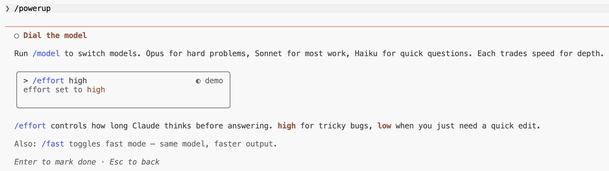

# Power-ups 最佳实践


通过动画演示教你 Claude Code 功能的互动课程。每个 power-up 教授一个大多数人错过的东西。v2.1.90 引入。

<table width="100%">
<tr>
<td><a href="../">← 返回 Claude Code 最佳实践</a></td>
<td align="right"></td>
</tr>
</table>

---

## 使用方法

```bash
claude
/powerup
```

---

## Power-ups (10)

<p align="center">
  
</p>

| # | Power-up | 主题 |
|---|----------|--------|
| 1 | Talk to your codebase | `@` 文件, 行引用 |
| 2 | Steer with modes | `shift+tab`, plan, auto |
| 3 | Undo anything | `/rewind`, `Esc-Esc` |
| 4 | Run in the background | tasks, `/tasks` |
| 5 | Teach Claude your rules | `CLAUDE.md`, `/memory` |
| 6 | Extend with tools | MCP, `/mcp` |
| 7 | Automate your workflow | skills, hooks |
| 8 | Multiply yourself | subagents, `/agents` |
| 9 | Code from anywhere | `/remote-control`, `/teleport` |
| 10 | Dial the model | `/model`, `/effort` |

---

## 示例：Dial the model

最后一个 power-up 通过动画演示教你模型切换和努力程度控制。

<p align="center">
  
</p>

<p align="center">
  
</p>

<p align="center">
  
</p>

---

## 来源

- [Changelog — v2.1.90](https://code.claude.com/docs/en/changelog)
