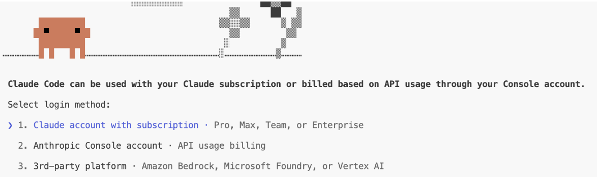

# Day 0 — Claude Code 安装

本指南带你完成 Claude Code 的安装和认证，让你可以开始使用。

## 步骤 1：安装 Claude Code

根据你的操作系统选择：

| 操作系统 | 指南 |
|----|-------|
| Windows | [windows.md](windows.md) |
| Linux | [linux.md](linux.md) |
| macOS | [mac.md](mac.md) |

按照你系统的指南操作，然后回到这里完成认证。

---

## 步骤 2：验证安装

按照系统特定指南完成后，确认一切正常：

```bash
node --version    # 应显示 v18.x 或更高
claude --version  # 应显示已安装的 Claude Code 版本
```

---

## 步骤 3：登录



在终端运行 `claude`。首次启动时会要求选择登录方式。

### 方式 1：订阅账户（Claude Pro / Max）

- 选择 **Claude.ai account**
- 浏览器打开 — 登录并授权
- 回到终端，登录完成

### 方式 2a：API Key（团队邀请）

你的团队管理员从 Anthropic dashboard 邀请你。

- 你收到**邀请邮件** — 接受并创建 Anthropic 账户
- 在终端运行 `claude`
- 选择 **Anthropic API Key**
- 你的 key 在 dashboard 上**自动生成** — 无需手动设置
- Claude Code 立即可用

### 方式 2b：API Key（已有 key）

如果有人分享 key 给你（通过 Slack、邮件等）或你自己创建：

- 在终端运行 `claude`
- 选择 **Anthropic API Key**
- 粘贴你的 key（以 `sk-ant-` 开头）
- Key **永久存储** — 不会再被询问

---